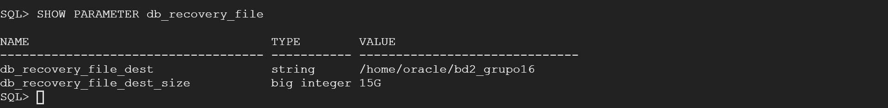
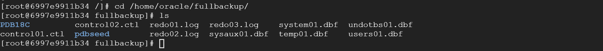
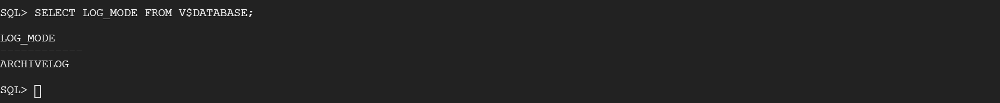
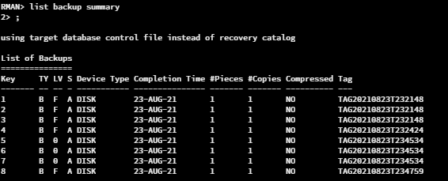
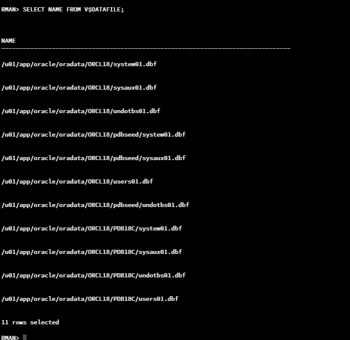
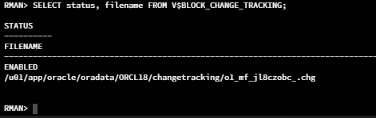

# Practica 1

**Contenido**
Comandos Docker Oracle
Habilitar FRA
Full Backup en modo NOARCHIVELOG
Habilitar modo ARCHIVELOG

## Comandos para utilizar Oracle con Docker

Descarga la imagen de Oracle 18c

```bash
$ docker pull dockerhelp/docker-oracle-ee-18c
```

 Crear contenedor

```bash
$ sudo docker run -p 1521:1521 -it dockerhelp/docker-oracle-ee-18c bash
```

Ejecutamos el archivo `post_install.sh` para iniciar Oracle

```bash
$ sh post_install.sh
```

Entramos a Oracle utilizando el comando:

```bash
$ sqlplus
```

---

## 1. Habilitar FRA

Se debe colocar la base de datos en modo ARCHIVELOG:

```bash
[oracle@localhost ~]$sqlplus / as sysdba
SQL>SHUTDOWN IMMEDIATE;
SQL>STARTUP MOUNT;
SQL>ALTER DATABASE ARCHIVELOG;
SQL>ALTER DATABASE OPEN;
```

Se crea un directorio destino para los archivos.
`/home/oracle/bd2_grupo16`

Se modifica el parámetro `DB_RECOVERY_FILE_DEST_SIZE`  y se específica el tamaño de área de recuperación rápida utilizando el comando:

```
SQL> ALTER SYSTEM SET DB_RECOVERY_FILE_DEST_SIZE = 15G SCOPE=BOTH;
```

Se modifica la ruta de almacenamiento de los archivos `redolog` y `flashback log` al directorio previamente creado.

```
SQL> ALTER SYSTEM SET DB_RECOVERY_FILE_DEST = '/home/oracle/bd2_grupo16' SCOPE=BOTH;
```

Comprobamos las modificaciones realizadas utilizando el comando:

```
SQL> SHOW PARAMETER db_recovery_file;
```

Obteniendo el siguiente resultado:


---

## 2. Creación de Full Backup en modo NoArchiveLog

Verificamos en que modo estamos trabajando con la instrucción:

```
SQL> SELECT LOG_MODE FROM V$DATABASE;
```

Si la base de datos no se encuentra en modo `noarchivelog` lo habilitamos con los siguientes comandos:

```
SQL>SHUTDOWN IMMEDIATE;
SQL>STARTUP MOUNT;
SQL>ALTER DATABASE NOARCHIVELOG;
SQL>ALTER DATABASE OPEN;
```

Una vez hemos cambiado al modo `noarchivelog` detenemos la base de datos nuevamente:

```
SQL> SHUTDOWN IMMEDIATE;
SQL> !
```

Ingresamos al directorio:

```bash
$ cd /u01/app/oracle/oradata/ORCL18
```

Se crea el directorio en el cual se almacenará el backup:

```
$ mkdir /home/oracle/fullbackup
```

Copiamos todos los archivos que se encuentran en el directorio `/u01/app/oracle/oradata/ORCL18` al que hemos creado en el paso anterior:

```
$ cp -R * /home/oracle/fullbackup/
```

Comprobamos que los archivos hayan sido copiados al directorio del backup, con el siguiente resultado:



---

## 3. Habilitar el modo ArchiveLog

Para habilitar el modo Archivelog ejecutamos los siguientes comandos:

```
SQL>SHUTDOWN IMMEDIATE;
SQL>STARTUP MOUNT;
SQL>ALTER DATABASE ARCHIVELOG;
SQL>ALTER DATABASE OPEN;
```

Comprobamos en que modo esta trabajando la base de datos:

```
$ SELECT LOG_MODE FROM V$DATABASE;
```

Obtenemos el siguiente resultado:


---

## 4. FullBackup y listar los backups existentes

Iniciar sesion en oracle con el ususario creado:

```
bases2 as sysdba 
```

Entra en rman con:

```
!rman target /
```

Realizar el backup con el siguiente comando:

```
backup database
```

Para listar backups existentes existe dos maneras:

```
1. list backup;
2. list backup summary;
```




## 5. Habilitar el Block Change Tracking

Desde rman se verifica la ubicación actual de los archivos de datos de la base de datos enviando la siguiente consulta:

```
SELECT NAME FROM V$DATAFILE;
```



Establecer el `DB_CREATE_FILE_DEST` parámetro de inicialización para especificar la ubicación donde se deben almacenar los nuevos archivos de base de datos

```
ALTER SYSTEM SET DB_CREATE_FILE_DEST = '/u01/app/oracle/oradata';
```

Habilitar el block change tracking para la base de datos usando el siguiente comando:

```
ALTER DATABASE ENABLE BLOCK CHANGE TRACKING;
```

Verificar que se realizo bien el cambio:

```
SELECT status, filename FROM V$BLOCK_CHANGE_TRACKING;
```



## 6. Configurar los Backups incrementales diario

Crear un archivo 

```
nano backupScri.sh
```

Ingresando lo siguiente:

```
rman target "'/ as sysdba'" << EOF

backup incremental level 1 database;
exit;
EOF
exit

```

Copiamos el archivo en el contenedor:

```
sudo docker cp backupScript.sh 699:/home/oracle/backupScri.sh
```

Se ingresa el backup incremental level 0;

```
BACKUP INCREMENTAL LEVEL 0 DATABASE;
```

Se ingresa el siguiente comando para que se ejecute todos los dias a las 2 am:

```
BEGIN
 DBMS_SCHEDULER.CREATE_JOB (
   job_name            =>  'BASES2_2AM', 
   job_type            =>  'EXECUTABLE',
   job_action          =>  '/home/oracle/backupScri.sh',
   start_date          =>  '24-AUG-21 2.00.00 AM America/Guatemala',
   repeat_interval     =>  'FREQ=DAILY',
   enabled               =>  true,
   auto_drop           =>  false);
END;
/
```

## 7. Configuración para que la retención del UNDO tablespace sea de 3 horas


UNDO RETENTION esta en segundo por lo tanto para que sea cada tres horas se ingresa el siguiente comando:

```
ALTER SYSTEM SET UNDO_RETENTION = 10800;
```

Determinar el período de retención actual:

```
select to_char(begin_time, 'DD-MON-RR HH24:MI') begin_time, to_char(end_time, 'DD-MON-RR HH24:MI') end_time, tuned_undoretention from v$undostat order by end_time;
```

